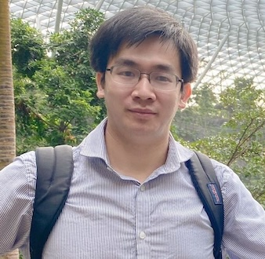
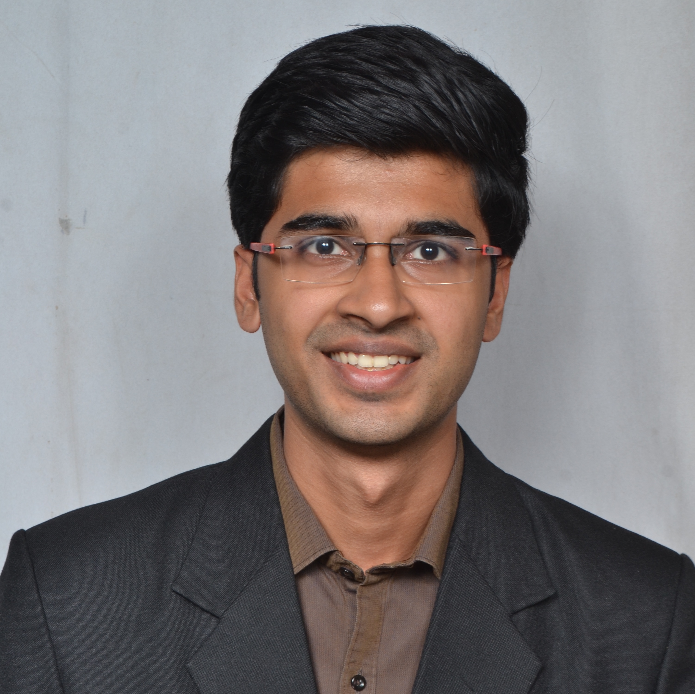
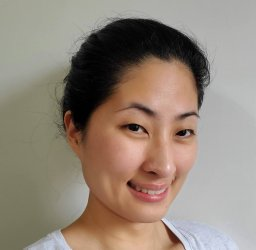
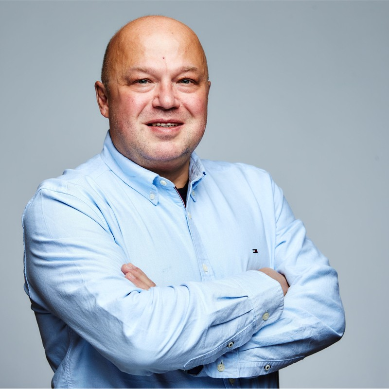

## Overview

Multimodal search and recommendation (MMSR) systems are at the forefront of modern information retrieval, designed to integrate and process diverse data types such as text, images, audio, and video within a unified framework. This integration enables more accurate and contextually relevant search results and recommendations, significantly enhancing user experiences. For example, e-commerce platforms have started supporting product searches through images to provide a streamlined shopping experience. Recent innovations in LLMs have extended their capabilities to handle multimodal inputs, allowing for a deeper and more nuanced understanding of content and user preferences.

MMSR will be a **half-day** workshop at [ICDM 2025](https://www3.cs.stonybrook.edu/~icdm2025/index.html). The workshop will be held on **November 12, 2025** in **Washington DC, USA**. The workshop will explore the latest advancements, challenges, and applications of multimodal search and recommendations.

## Important Dates

{: .box-note}
All deadlines are at 23: 59 P.M. [AoE](https://www.worldtimeserver.com/time-zones/aoe/)

| Task                                                                                                      | Deadline              |
| --------------------------------------------------------------------------------------------------------- | --------------------- |
| [Paper submission deadline](https://wi-lab.com/cyberchair/2025/icdm25/scripts/submit.php?subarea=S25) | September 1, 2025 |
| Notification of acceptance                                                                                | September 15, 2025    |
| Camera Ready Version of Papers Due                                                                        | September 25, 2025    |
| **MMSR '25 Workshop**                                                                                         | **November 12, 2025 8.30 AM EST - 12.30 PM EST**     |

## Schedule

| Time | Session Details |
| ---- | ---------------- |
| 8:30 - 8:35 | **Opening Remarks** Welcome to ISIR-eCom & MMSR |
| 8:35 - 8:45 | **Virtual Talk 1: UNION: A Lightweight Target Representation for Efficient Image-Guided Retrieval with Optional Textual Queries** Authors: Hoang-Bao Le, Allie Tran, Binh T. Nguyen, Liting Zhou, Cathal Gurrin |
| 8:45 - 8:55 | **Virtual Talk 2: NoiseStat: A Lightweight Diagnostic Framework for Retrieval Robustness under Noise** Authors: Bodhisatta Maiti, Debshree Chowdhury |
| 8:55 - 9:05 | **Virtual Talk 3: Enhancing Product Recommendations with Multi-Modal LLMs** Authors: Babaniyi Olaniyi |
| 9:05 - 9:15 | **Virtual Talk 4: Query Attribute Modeling: Improving Search Relevance with Semantic Search and Meta Data Filtering** Authors: Karthik Menon, Batool Arhamna Haider, Muhammad Arham, Kanwal Mehreen, Ram Mohan Rao Kadiyala, Muhammad Ali Shafique, Hamza Farooq |
| 9:15 - 9:30 | **Contributed Talk 1: Will It Zero-Shot?: Predicting Zero-Shot Classification Performance For Arbitrary Queries** Authors: Kevin Robbins, Xiaotong Liu, Yu Wu, Grady McPeak, Le Sun, Abby Stylianou, Robert Pless |
| 9:30 - 9:45 | **Contributed Talk 2: FUSE: Failure-aware Usage of Subagent Evidence for MultiModal Search and Recommendation** Authors: Tushar Vatsa, Vibha Belavadi, Priya Shanmugasundaram, Suhas Suresha, Dewang Sultania |
| 9:45 - 10:00 | **Contributed Talk 3: PMMR: Query-Adaptive Geo-Personalized Multimodal Ranking for Creative Search at Scale** Authors: Liping Zhang, Tracy King, Ravindra Sadaphule, Jayant Kumar |
| 10:00 - 10:30 | **Coffee Break** |
| 10:30 - 11:15 | **Invited Talk: Revisiting Composite Item Retrieval in the Era of Large Language Models: Challenges and Opportunities** Speaker: Prof. Senjuti Basu Roy  This talk revisits the emerging problem of composite item retrieval - retrieving meaningful combinations of items rather than single entities - and how it redefines similarity through set-level reasoning to evaluate how items work together. Prof. Basu Roy will explore how large language models (LLMs) enable intelligent, context-aware product search that captures compatibility, complementarity, and user intent beyond traditional top-k scoring. The talk also addresses challenges such as LLM cost, latency, and interpretability, and highlights opportunities for adaptive, explainable, and human-aligned retrieval frameworks for next-generation e-commerce systems. |
| 11:15 - 11:30 | **Contributed Talk 4: Scaling Multimodal Search and Recommendation with Small Language Models via Upside-Down Reinforcement Learning** Authors: Yu-Chen Lin, Sanat Sharma, Hari Manikandan, Jayant Kumar, Tracy King, Jing Zheng |
| 11:30 - 11:45 | **Contributed Talk 5: CTMR: Cohort-Aware Transformer Multi-Objective Ranker for Personalized, Debiased, and Diversity-Aware Product Search** Authors: Liping Zhang |
| 11:45 - 12:30 | **Invited Talk: On the Intersection of Language and Graph Models** Speaker: Prof. Chuxu Zhang  AI is undergoing a transformative shift with the rise of powerful models such as large language models and graph neural networks. In this talk, Prof. Zhang presents research at the intersection of these two paradigms, illustrating how they can complement and enhance one another. He also discusses how their synergy enables advances in information retrieval and NLP tasks, including question answering, recommender systems, and advanced reasoning. |
| 12:30 | **Closing Notes** |

---

## Keynote Speakers

  

    
    

      <strong><a href="https://www.linkedin.com/in/senjuti-basu-roy-a7217513/" style="text-decoration: none;color: black;">Prof. Senjuti Basu Roy</a></strong> is an Associate Professor and Director of the Big Data Analytics Lab (BDAL) at the New Jersey Institute of Technology, NJ.
    

  

  

    
    

      <strong><a href="http://linkedin.com/in/chuxu-zhang-22504878/" style="text-decoration: none;color: black;">Prof. Chuxu Zhang</a></strong> is an Associate Professor and Director of the MINDS Labs at the University of Connecticut, CT.
    

  

## Organizers

  
  

    
    <strong><a href="https://www.linkedin.com/in/aditya-chichani/" style="text-decoration: none;color: black;">Aditya Chichani</a></strong>
  

  
  

    
    <strong><a href="https://www.linkedin.com/in/surya-kallumadi-a0778a13/" style="text-decoration: none;color: black;">Surya Kallumadi</a></strong>
  

  

    
    <strong><a href="https://www.linkedin.com/in/tracyhollowayking/" style="text-decoration: none;color: black;">Tracy Holloway King</a></strong>
  

  

    
    <strong><a href="https://www.linkedin.com/in/yubink" style="text-decoration: none;color: black;">Yubin Kim</a></strong>
  

  

    
    <strong><a href="https://www.linkedin.com/in/lopatenko/" style="text-decoration: none;color: black;">Andrei Lopatenko</a></strong>
  

