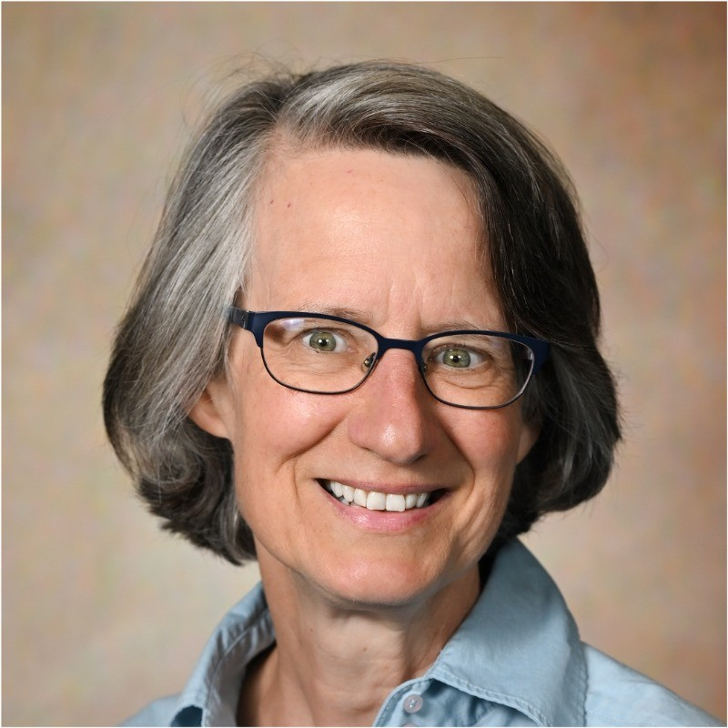
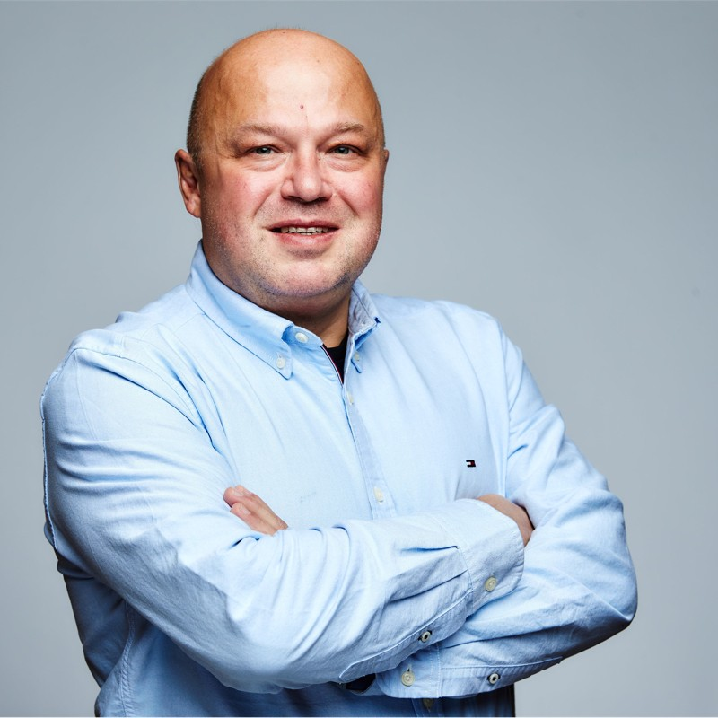

## Overview

The advent of multimodal LLMs like GPT-4o and Gemini has significantly boosted the potential for multimodal search and recommendations. Traditional search engines rely mainly on textual queries, supplemented by session and geographical data. In contrast, multimodal systems create a shared embedding space for text, images, audio, and more, enabling next-gen customer experiences. These advancements lead to more accurate and personalized recommendations, enhancing user satisfaction and engagement.

MMSR will be a **full-day** workshop at [CIKM 2024](https://cikm2024.org/). The workshop will be held on **October 25, 2024** at **Boise Center, Idaho, USA**. The workshop will explore the latest advancements, challenges, and applications of multimodal search and recommendations.

**[Register to attend the workshop](https://cikm2024.org/registrations/)**

## Workshop Program Format

The workshop will include keynote speeches, research paper presentations, interactive networking sessions, and a panel discussion on **_Emerging trends and challenges in multimodal search and recommendations_**. The workshop will primarily be in person.

## Schedule

| Time          | Session Details                                                                                                                                                                                                                                                                                                                                                                                                                                                                                            |
| ------------- | ---------------------------------------------------------------------------------------------------------------------------------------------------------------------------------------------------------------------------------------------------------------------------------------------------------------------------------------------------------------------------------------------------------------------------------------------------------------------------------------------------------- |
| 9:00 - 9:10   | **Opening Remarks**                                                                                                                                                                                                                                                                                                                                                                                                                                                                                        |
| 9:10 - 10:10   | **Invited Talk: LLMs are magic … or are they? Stories from the trenches of building a startup on GenAI** Speaker: Yubin Kim At the beginning of this year, Yubin became employee #2 at Vody, an e-commerce startup specializing in using multimodal LLMs to produce business value for retailers. In this talk, Yubin will share three stories from the trenches of building a startup from the ground up using LLMs, where the technology was pure magic, not-so-magical, and something in between. |                                                                                                                                                                                                                                                                                                                     |
| 10:10 - 10:30 | **Contributed Talk 1: Do We Trust What They Say, or What They Do? A Multimodal User Embedding Provides Personalized Explanations** Authors: Zhicheng Ren, Zhiping Xiao, Yizhou Sun                                                                                                                                                                                                                                                                                               |
| 10:30 - 11:00 | **Coffee Break**                                                                                                                                                                                                                                                                                                                                                                                                                                                                                           |
| 11:00 - 11:45 | **Invited Talk: Toward Transmodal Information Experiences (TIE)** Speaker: Chirag Shah Transmodal Information Experiences (TIE) enable users to seamlessly interact with information across multiple modalities—such as vision, voice, and touch—without being constrained by a specific input method. Chirag will discuss how understanding user intents and tasks can help design systems that focus on users’ goals rather than the input modality, with examples from his research.              |
| 11:45 - 12:05 | **Contributed Talk 3: Evaluating Cost-Accuracy Trade-offs in Multimodal Search Relevance Judgements** Authors: Silvia Terragni, Cuong Hoang, Joachim Daiber, Pallavi Gudipati, Pablo N. Mendes                                                                                                                                                                                                                                                                                                          |
| 12:05 - 12:25 | **Contributed Talk 2: Understanding Modality Preferences in Search Clarification** Authors: Leila Tavakoli, Giovanni Castiglia, Federica Calò, Yashar Deldjoo, Hamed Zamani, Johanne Trippas                                                                                                                                                                                                                                  |
| 12:25 - 12:45 | **Contributed Talk 4: Smart Multi-Modal Search: Contextual Sparse and Dense Embedding Integration in Adobe Express** Authors: Chirag Arora, Tracy Holloway King, Jayant Kumar, Yi Lu, Sanat Sharma, Arvind Srikantan, David Uvalle, Josep Valls-Vargas, Harsha Vardhan                                                                                                                                                                                                                                                                                                                                                                                                                                                                                     |
| 12:45 - 1:45  | **Lunch Break**                                                                                                                                                                                                                                                                                                                                                                                                                                                                                            |
| 1:45 - 2:30   | **Invited Talk: How Multimodality Can Help Customers Shop Better: An Amazon Perspective** Speaker: Vamsi Salaka                                                                                                                                                                                                                                                                                                                                                                                         |
| 2:30 - 2:50   | **Contributed Talk 5: Designing Multimodal Search Interfaces** Authors: Owen Pendrigh Elliott, Tom Hamer, Jesse Clark                                                                                                                                                                                                                                                                                                                                                                                   |
| 2:50 - 3:10   | **Contributed Talk 6: CBVS: A Large-Scale Chinese Image-Text Benchmark for Real-World Short Video Search Scenarios** Authors: Xiangshuo Qiao, Xianxin Li, Xiaozhe Qu, Jie Zhang, Yang Liu, Yu Luo, Cihang Jin, Jin Ma                                                                                                                                                                                                                                                                                   |
| 3:10 - 3:30   | **Networking Session**                                                                                                                                                                                                                                                                                                                                                                                                                                                                                     |
| 3:30 - 4:00   | **Coffee Break**                                                                                                                                                                                                                                                                                                                                                                                                                                                                                           |
| 4:00 - 5:00   | **Panel Discussion: GenAI for Search and Recommendations** Joint Workshop Panel Discussion (MMSR'24 and GenAI Ecom '24) **Moderator**: Tracy Holloway King **Panelists**: Vamsi Salaka, Aditya Chichani, Dingxian Wang, Topojoy Biswas, Djordje Gligorijevic **Venue for Joint Panel Discussion**: Room 110BC                                                                                                                                                                                                                                                                                                                  |

## Keynote Speakers

  

    
    

      <strong><a href="https://www.linkedin.com/in/vamsisalaka/" style="text-decoration: none;color: black;">Dr. Vamsi Salaka</a></strong> is the Head of Visual Search at Amazon where he oversees initiatives to build cutting edge image and multimodal search systems.
    

  

  

    
    

      <strong><a href="https://www.linkedin.com/in/yubink/" style="text-decoration: none;color: black;">Dr. Yubin Kim</a></strong> is the Head of Engineering at Vody, a multimodal GenAI startup. Dr. Kim is a seasoned search & recommendations leader with experience in pragmatically solving multimodal problems at scale.
    

  

  

    
    

      <strong><a href="https://chiragshah.org/" style="text-decoration: none;color: black;">Dr. Chirag Shah</a></strong> is a Professor at the University of Washington, Seattle, Director of InfoSeeking Lab, and Co-Director of RAISE, a center for responsible AI. His research involves building intelligent information access systems, focusing on task-oriented search, proactive recommendations, and conversational systems, to make them personalized, robust, and trustworthy.
    

  

## Organizers

  

    
    <strong><a href="https://www.linkedin.com/in/aditya-chichani/" style="text-decoration: none;color: black;">Aditya Chichani</a></strong>
  

  
  

    
    <strong><a href="https://www.linkedin.com/in/surya-kallumadi-a0778a13/" style="text-decoration: none;color: black;">Surya Kallumadi</a></strong>
  

  

    
    <strong>
    <a href="https://www.linkedin.com/in/tracyhollowayking/" style="text-decoration: none;color: black;">Tracy Holloway King</a>
    </strong>
  

  

    
    <strong><a href="https://www.linkedin.com/in/lopatenko/" style="text-decoration: none;color: black;">Andrei Lopatenko</a></strong>
  

## Important Dates

{: .box-note}
All deadlines are at 23: 59 P.M. [GMT](https://www.worldtimeserver.com/time-zones/gmt/)

| Task                                                                                             | Deadline               |
| ------------------------------------------------------------------------------------------------ | ---------------------- |
| ~~[Paper submission deadline](https://openreview.net/group?id=ACM.org/CIKM/2024/Workshop/MMSR)~~ | ~~August 16, 2024~~    |
| ~~Notification of acceptance~~                                                                   | ~~August 30, 2024~~    |
| **[Camera Ready Version of Papers Due](cfp.md#camera-ready-instructions)**                       | **September 30, 2024** |
| MMSR '24 Full Day Workshop                                                                       | **October 25, 2024**   |
